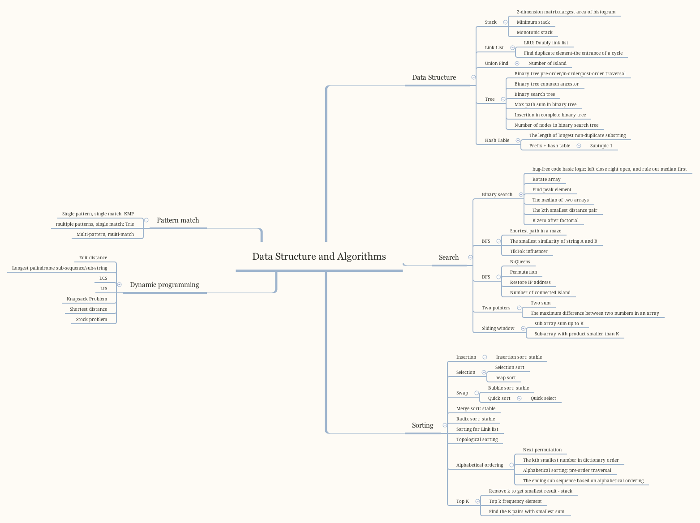

# Data Structure and Algorithms

In this repo, I will follow the picture below and cover the commonly-seen data structure and algorithms with leetcode examples.  

A little bit about my data structure and algorithms learning path.  

I took data structure course in my undergrad, but forget about almost everything before I took the algorithms course in my master. In march, I received an interview request from Google,  and the moment when I received the email was when I really started to pick up everything I learned and use data structure and algorithms to solve leetcode problem. I was lucky enough to make it to final round, but still got rejected. But thanks to this experience, I become more comfortable with data structure and algorithms.

During the preperation process, my leetcode record hit 200 + from 30 +, and finally get a sense of how the data structure and algorithms thing work. To solidify my data structure and algorithm knowledge, I decided to initialize this repo. If you are new to data structure and algorithms, here are a fews things I would highly recommend you to do: 
> 
> * Take a look at those commonly-used data structures, like stack, link list, tree, etc, and get yourself comfortable with the most common operations (insert, delete, reverse, modify, access an element) on these data structures and their time complexity in big O notation.
> * Take at least one algorithm course, [this](https://classroom.udacity.com/courses/ud401) is online version of the one I took at Georgia Tech. I really like the professor, because he explains thing well, and I believe the online version is as good as the on-campus one. Note that this course is entirely theory-based. Another popular algorithm course is [this one](https://www.coursera.org/learn/algorithms-part1) from Princeton University, which I found is much harder than the one I took. The Princeton one involves coding in Java. If you want to get more practice on coding out those algorithms, the later one is probably a better option. 
> * Practice, practice, and practice...  

* Stack